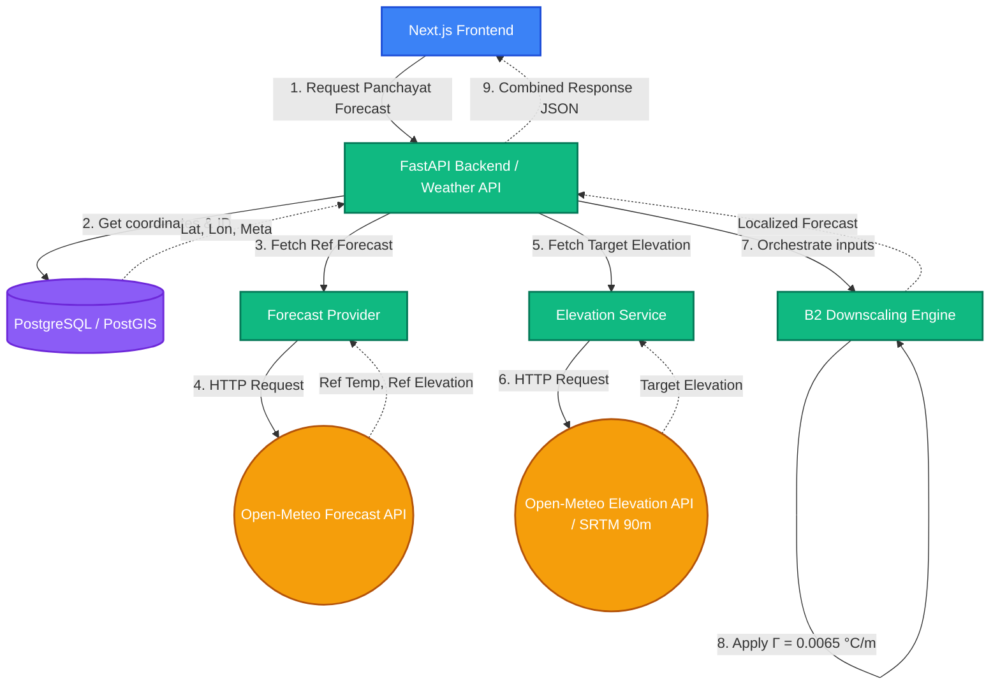

# GramWeather MVP Architecture

This diagram illustrates the flow of data through the GramWeather MVP, showing how the frontend, backend, database, and external providers coordinate to generate a localized forecast using the B2 Physical Lapse-Rate correction.

